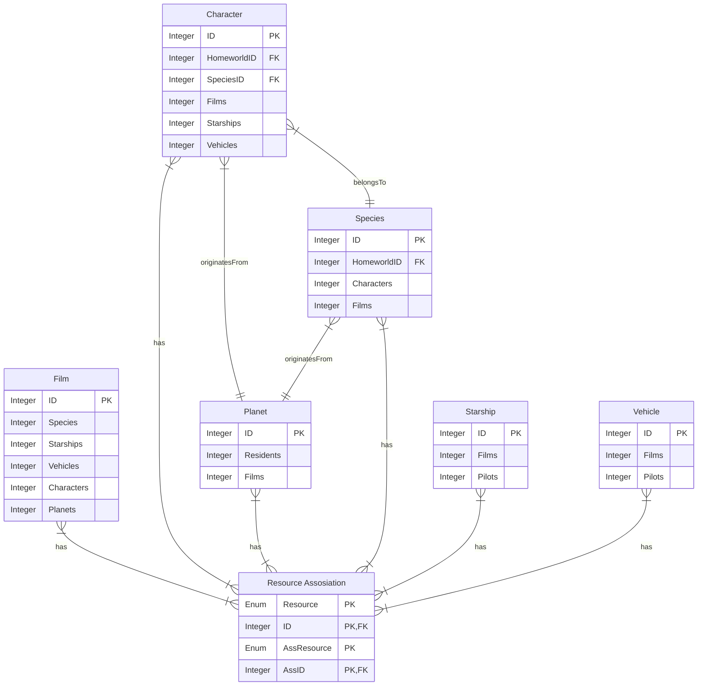

# BC-SWAPI
Business Central SWAPI Integration

## Description

**BC-SWAPI** is a project that seamlessly integrates data from the Star Wars API (SWAPI) into Microsoft Dynamics 365 Business Central. Here's what you need to know:

This ER diagram outlines the database structure implemented for managing the utilized data. It includes entities like Film, Character, Planet, Species, Starship, and Vehicle, each with their corresponding attributes. Additionally, there's a 'Resource Association' table facilitating the many-to-many relationship between Film and other resources such as Character, Planet, Species, Starship, and Vehicle.

### About SWAPI
- SWAPI (Star Wars API) is based on the original data set from [swapi.dev](https://swapi.dev/), which in turn was sourced from [swapi.co](https://swapi.dev/about).
- The data includes information about People, Films, Species, Starships, Vehicles, and Planets from the Star Wars universe.
- The project was initially a Python-based data model that exposed data from the community wiki [Wookiepedia](https://starwars.fandom.com/wiki/Wookieepedia).

### Objectives of BC-SWAPI
1. **Data Alignment**:
   - Align SWAPI data with the existing data structure in Business Central.
   - Ensure consistency and coherence for seamless access and analysis.

2. **Leveraging Business Central Capabilities**:
   - **Analysis**:
     - Utilize Business Central's robust analytical features for trend analysis, forecasting, and performance evaluation.
   - **Clarity and Organization**:
     - Structure SWAPI information within Business Central.
     - Define entities, relationships, and attributes for an organized extension.

3. **Demo Data**:
   - Use SWAPI data as demo content within the ERP software environment:
     - **Training**: Train users using familiar Star Wars scenarios.
     - **Testing**: Validate system functionality with realistic data.
     - **Showcase**: Demonstrate Business Central's capabilities to stakeholders.

By integrating SWAPI data, the gap between the galaxy far, far away and the world of enterprise resource planning is bridged. May the data be with you!

## Requirements

## Download and Installation

## Contribution

Contributions to this repository are welcome! If you have additional ideas or improvements, feel free to submit pull requests.

## License

This repository is licensed under the [MIT License](LICENSE).
